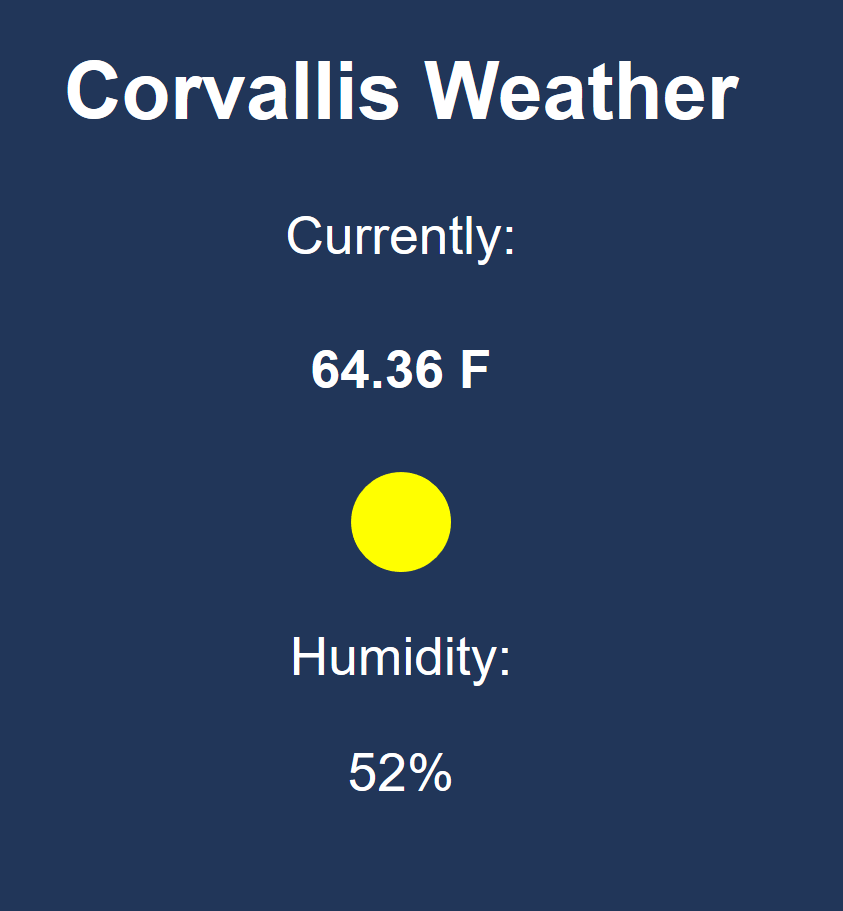

## [Corvallis Weather](https://jorgemanzo.github.io/corvallisWeather/) :sunny: :cloud: :umbrella:
------
A minimal(ish) web based simple weather app for any city in the U.S. with a zip code!.
Currently displays temperature and humidity, along with a changing
sun and moon, as well as fitting background music from Mario games because
why not.

Now supports a city near you! Go ahead and take a look!

#### Plans
1. Store Music on a server instead of using Google's iFrame api, as it sucks for
mobile users.
2. More Songs
3. More Specific weather representations like:
 * Rain
 * Snow
 * Fog
 * Wind
4. Nicer user interface, whatever that may be.

## Using Open Weather Map API
------

Uses Open Weather Map's API to call for weather information and assembles to a
JSON file which is nice and fun to work with.
